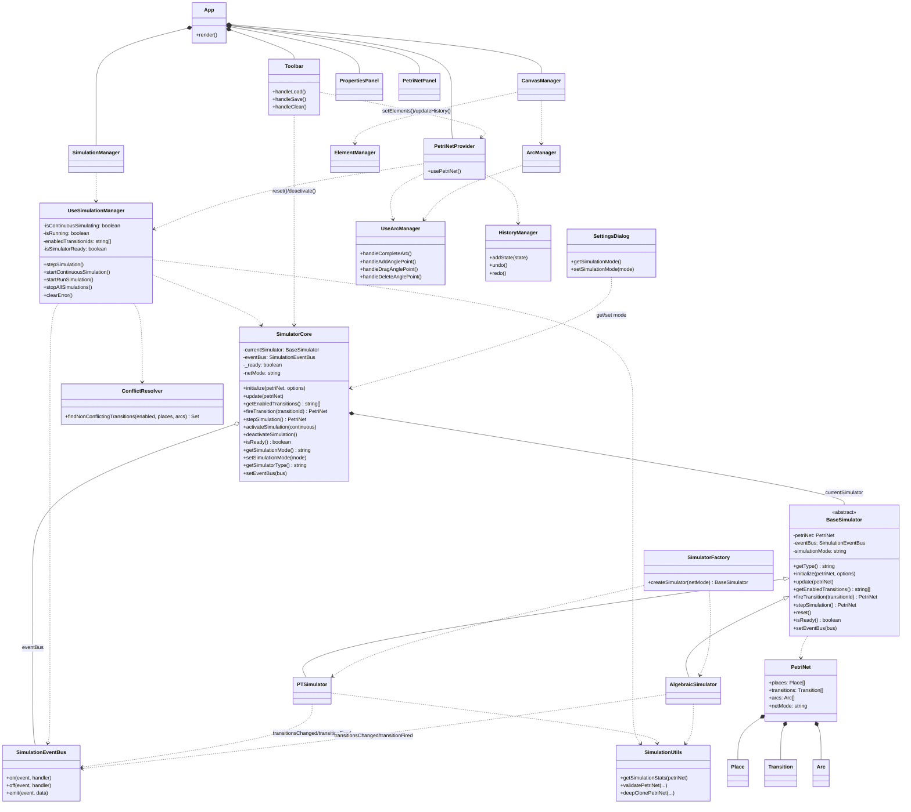

## UML Class Diagram

```mermaid
classDiagram
  class App {
    +render()
  }

  class PetriNetProvider {
    +usePetriNet()
  }

  class SimulationManager
  class UseSimulationManager {
    -isContinuousSimulating: boolean
    -isRunning: boolean
    -enabledTransitionIds: string[]
    -isSimulatorReady: boolean
    +stepSimulation()
    +startContinuousSimulation()
    +startRunSimulation()
    +stopAllSimulations()
    +clearError()
  }

  class SimulatorCore {
    -currentSimulator: BaseSimulator
    -eventBus: SimulationEventBus
    -_ready: boolean
    -netMode: string
    +initialize(petriNet, options)
    +update(petriNet)
    +getEnabledTransitions() string[]
    +fireTransition(transitionId) PetriNet
    +stepSimulation() PetriNet
    +activateSimulation(continuous)
    +deactivateSimulation()
    +isReady() boolean
    +getSimulationMode() string
    +setSimulationMode(mode)
    +getSimulatorType() string
    +setEventBus(bus)
  }

  class BaseSimulator {
    <<abstract>>
    -petriNet: PetriNet
    -eventBus: SimulationEventBus
    -simulationMode: string
    +getType() string
    +initialize(petriNet, options)
    +update(petriNet)
    +getEnabledTransitions() string[]
    +fireTransition(transitionId) PetriNet
    +stepSimulation() PetriNet
    +reset()
    +isReady() boolean
    +setEventBus(bus)
  }

  class PTSimulator
  class AlgebraicSimulator

  class SimulatorFactory {
    +createSimulator(netMode) BaseSimulator
  }

  class SimulationEventBus {
    +on(event, handler)
    +off(event, handler)
    +emit(event, data)
  }

  class ConflictResolver {
    +findNonConflictingTransitions(enabled, places, arcs) Set
  }

  class SimulationUtils {
    +getSimulationStats(petriNet)
    +validatePetriNet(...)
    +deepClonePetriNet(...)
  }

  class Toolbar {
    +handleLoad()
    +handleSave()
    +handleClear()
  }

  class SettingsDialog {
    +getSimulationMode()
    +setSimulationMode(mode)
  }

  class CanvasManager
  class ElementManager
  class ArcManager
  class UseArcManager {
    +handleCompleteArc()
    +handleAddAnglePoint()
    +handleDragAnglePoint()
    +handleDeleteAnglePoint()
  }
  class PropertiesPanel
  class PetriNetPanel

  class HistoryManager {
    +addState(state)
    +undo()
    +redo()
  }

  class PetriNet {
    +places: Place[]
    +transitions: Transition[]
    +arcs: Arc[]
    +netMode: string
  }
  class Place
  class Transition
  class Arc

  BaseSimulator <|-- PTSimulator
  BaseSimulator <|-- AlgebraicSimulator

  SimulatorFactory ..> PTSimulator
  SimulatorFactory ..> AlgebraicSimulator

  SimulatorCore *-- BaseSimulator : currentSimulator
  SimulatorCore o-- SimulationEventBus : eventBus
  BaseSimulator ..> PetriNet
  PetriNet *-- Place
  PetriNet *-- Transition
  PetriNet *-- Arc

  UseSimulationManager ..> SimulatorCore
  UseSimulationManager ..> ConflictResolver
  UseSimulationManager ..> SimulationEventBus
  UseSimulationManager ..> SimulationUtils

  SimulationManager ..> UseSimulationManager

  PetriNetProvider ..> HistoryManager
  PetriNetProvider ..> UseSimulationManager
  PetriNetProvider ..> UseArcManager

  App *-- PetriNetProvider
  App *-- Toolbar
  App *-- PropertiesPanel
  App *-- PetriNetPanel
  App *-- SimulationManager
  App *-- CanvasManager

  CanvasManager ..> ElementManager
  CanvasManager ..> ArcManager

  ArcManager ..> UseArcManager

  Toolbar ..> SimulatorCore : reset()/deactivate()
  Toolbar ..> PetriNetProvider : setElements()/updateHistory()

  SettingsDialog ..> SimulatorCore : get/set mode

  PTSimulator ..> SimulationEventBus : transitionsChanged/transitionFired
  AlgebraicSimulator ..> SimulationEventBus : transitionsChanged/transitionFired
  PTSimulator ..> SimulationUtils
  AlgebraicSimulator ..> SimulationUtils
```

