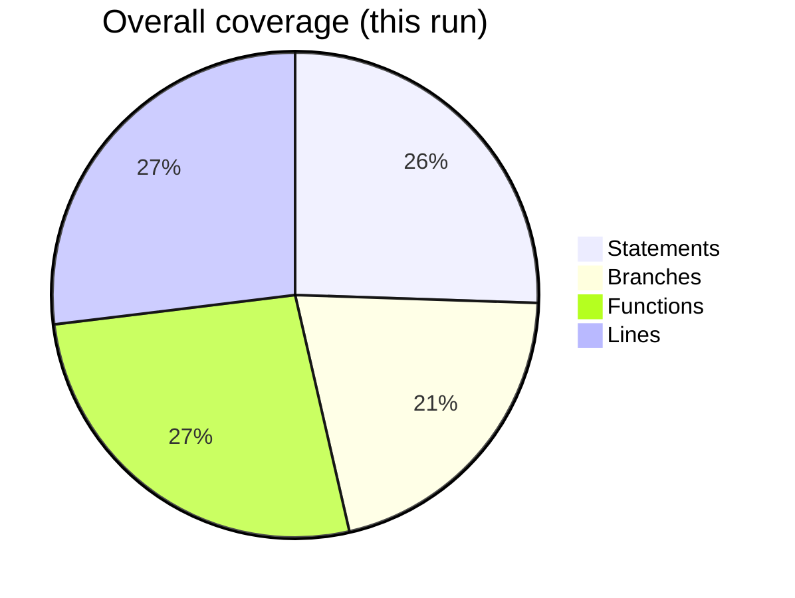

## Unit Test Report — Petri Net Editor (2025-10-31)

### Executive summary

- **Suites/Tests**: 136 suites, 490 tests, 0 failures
- **Overall Coverage** (this run):
  - **Statements**: 78.93%
  - **Branches**: 64.59%
  - **Functions**: 82.43%
  - **Lines**: 83.31%



### Architecture-to-tests traceability (high-level)

```mermaid
graph TD
  A[UI Components] --> A1[components/* tests]
  B[Contexts] --> B1[contexts/* tests]
  C[Features - Simulation] --> C1[simulator-core / BaseSimulator / PT / algebraic]
  C --> C2[useSimulationManager*]
  C --> C3[SimulationEventBus]
  D[Features - Selection/History/Keymap] --> D1[selection-utils*]
  D --> D2[historyManager*]
  D --> D3[useKeyboardShortcuts*]
  E[Utils - PNML/Parsing/ADT] --> E1[pnml.reader / writer / normalize]
  E --> E2[parse-* (arithmetic, types, pattern)]
  F[Utils - Z3] --> F1[eval-bool / eval-arith / builders]
  G[Integration] --> G1[python/index]
  H[Workers] --> H1[worker-factory]

  %% Representative usage links
  C1 -->|uses| E1
  C1 -->|uses| E2
  C1 -->|uses| F1
  C2 -->|orchestrates| C1
  C1 -->|helpers| C3
  C1 -->|helpers| D1
  D2 -->|drives UI undo/redo| A
```

### Coverage details (selected modules)

- These reflect `coverage/coverage-summary.json` and highlight areas of strength and risk.
  - **High coverage (>= 90% lines)**: `features/simulation/conflict-resolver.js` (98.79%), `utils/pnml/writer.js` (98.70%), `features/selection/selection-utils.js` (100%), `features/history/historyManager.js` (86.20% lines, strong overall), `workers/worker-factory.js` (91.66%), many PNML utilities.
  - **Moderate coverage (60–89% lines)**: `features/simulation/simulator-core.js` (85.35%), `features/simulation/pt-simulator.js` (86.51%), `features/simulation/algebraic-simulator.js` (74.04%), `utils/parse/*` (80–95%), most components.
  - **Lower coverage (< 50% lines)**: `components/AdtDialog.jsx` (1.33%), `components/ModeButtons.jsx` (33.33%), `features/simulation/ops/registry.js` (33.33%), `features/simulation/useSimulationManager.js` (58.74% lines, but lower branches 42.04%), `utils/z3/eval-arith.js` (46.25%).

### What the test suites cover

Below is an exhaustive listing of unit test suites organized by architecture area, with brief, precise descriptions of intent and behavior scope.

#### Features (Simulation, Selection, History, Keymap)

- src/__tests__/features/useSimulationManager.worker.test.jsx: Worker-backed orchestration, message passing, activation/teardown.
- src/__tests__/features/token-io.test.js: Token serialization/deserialization across simulation I/O paths.
- src/__tests__/features/useSimulationManager.nonvisual.test.jsx: Nonvisual simulation flows and state updates.
- src/__tests__/features/simulator-core.test.js: Net mode detection, initialization, enabled transitions, fire/step error handling.
- src/__tests__/features/assignment.test.js: Variable assignment and guard/type checks in simulations.
- src/__tests__/features/BaseSimulator.test.js: Base simulator lifecycle, enabling/firing semantics, guards.
- src/__tests__/features/SimulationEventBus.test.js: Event publish/subscribe, handler lifecycle.
- src/__tests__/features/simulation-utils.test.js: PNML parsing error propagation, net normalization helpers.
- src/__tests__/features/conflict-resolver.test.js: Conflict set computation, maximal-mode selection.
- src/__tests__/features/pt-simulator.test.js: P/T simulator init, marking updates, logging and metrics.
- src/__tests__/features/simulator-factory.test.js: Factory selection and fallback strategies.
- src/__tests__/features/useSimulationManager.timers.edgecases.test.jsx: Timing edge cases, debouncing, cancellation.
- src/__tests__/features/selection-utils.arcs.move.test.js: Arc move operations and constraints.
- src/__tests__/features/useKeyboardShortcuts.thresholds.test.jsx: Keymap thresholds, repeat behavior.
- src/__tests__/features/selection-utils.thresholds.test.js: Selection thresholds and hit testing.
- src/__tests__/features/history/historyManager.validate.test.js: Structural validation of history entries.
- src/__tests__/features/history/historyManager.moreDiffs.test.js: Rich diffing across places/transitions/arcs.
- src/__tests__/features/useSimulationManager.noenabled.test.jsx: Behavior when no transitions are enabled.
- src/__tests__/features/history/historyManager.diffs.test.js: State/secondary property diffs.
- src/__tests__/features/history/historyManager.branches.test.js: Branch navigation, undo/redo constraints.
- src/__tests__/features/useSimulationManager.branches.test.jsx: Branch-heavy flows and branching outcomes.
- src/__tests__/features/useSimulationManager.di.test.jsx: Dependency injection-based flows.
- src/__tests__/features/useSimulationManager.flows.test.jsx: Happy-path and error-path orchestration.
- src/__tests__/features/selection-utils.nosnap.test.js: Selection without snapping.
- src/__tests__/features/useSimulationManager.errors.test.jsx: Error propagation and recovery.
- src/__tests__/features/useSimulationManager.test.jsx: Core hook behavior: activation, stepping, teardown.
- src/__tests__/features/useKeyboardShortcuts.test.jsx: Global shortcuts trigger and guard behavior.
- src/__tests__/features/net-ops.test.js: Net create/remove/connect ops and invariants.
- src/__tests__/features/clipboard-utils.test.js: Clipboard serialization, round-trips, validation.
- src/__tests__/features/selection-utils.test.js: Selection primitives and matrix.
- src/__tests__/features/graph-index.test.js: Graph index building/query invariants.
- src/__tests__/features/algebraic-simulator.test.js: Algebraic simulator init, enablement, step semantics.
- src/__tests__/features/type-inference.test.js: Type inference flows over ADTs and patterns.
- src/__tests__/features/history/historyManager.test.js: History lifecycle, add/compare/undo/redo.
- src/__tests__/features/pattern-output-production.test.js: Pattern output assembly and constraints.
- src/__tests__/features/pattern-deconstruction.test.js: Pattern deconstruction across term structures.

#### Utils (PNML, Parsing, Tokens, Z3, Misc)

- src/__tests__/utils/z3/eval-arith.test.js: Arithmetic evaluation over ADTs, integers, lists.
- src/__tests__/utils/z3/eval-arith.solver.coverage.test.js: Solver-backed arithmetic coverage paths.
- src/__tests__/utils/z3-arith.test.js: Integration surface for arithmetic helpers.
- src/__tests__/utils/python.index.test.js: PNML import/export wrappers, error surfaces.
- src/__tests__/utils/z3/builders.errors.more.test.js: Builder error handling (additional branches).
- src/__tests__/utils/pnml.reader.tokens.various.test.js: Token reading across mixed encodings.
- src/__tests__/utils/parse/arithmetic-impl.stringify.vars.test.js: Arithmetic stringify with variables.
- src/__tests__/utils/pnml.writer.omissions.test.js: Omit rules and warnings while writing PNML.
- src/__tests__/utils/pnml.reader.defaults.test.js: Reader defaults and missing attributes.
- src/__tests__/utils/parse/types-impl.annotations.errors.test.js: Type annotation error branches.
- src/__tests__/utils/z3/eval-arith.lists.coverage.test.js: Arithmetic over lists and coverage edges.
- src/__tests__/utils/pnml.reader.metadata.test.js: PNML metadata parsing.
- src/__tests__/utils/pnml.writer.metadata.test.js: PNML metadata writing.
- src/__tests__/utils/parse/arithmetic-impl.stringify.test.js: Arithmetic stringify core paths.
- src/__tests__/utils/parse/arithmetic-impl.errors.more.test.js: Additional arithmetic error branches.
- src/__tests__/utils/z3/eval-bool.precedence.matrix.test.js: Boolean operator precedence matrix.
- src/__tests__/utils/pnml.reader.string-escapes.test.js: Escapes and text content.
- src/__tests__/utils/pnml.writer.place-type-apnns.test.js: Place typing for algebraic nets.
- src/__tests__/utils/pnml.writer.binding-array.test.js: Binding array serialization.
- src/__tests__/utils/pnml.reader.tokens.strings-and-pair-split.test.js: Split tokens/pairs from text.
- src/__tests__/utils/pnml.writer.action-apnns.test.js: Action serialization for APNNs.
- src/__tests__/utils/pnml.writer.markings.format.test.js: Markings format rules.
- src/__tests__/utils/pnml.writer.binding-string.test.js: Binding string encoding/decoding.
- src/__tests__/utils/pnml.reader.binding-split.test.js: Binding split heuristics.
- src/__tests__/utils/pnml.reader.missingpage.test.js: Missing page error handling.
- src/__tests__/utils/parse/arithmetic-impl.errors.test.js: Arithmetic error paths.
- src/__tests__/utils/pnml.writer.apnns.test.js: APNN-specific writer branches.
- src/__tests__/utils/parse/types-impl.auto.test.js: Type inference automation coverage.
- src/__tests__/utils/pnml.reader.bindings.test.js: Binding parsing and validation.
- src/__tests__/utils/pnml.reader.weights.test.js: Weight parsing and defaults.
- src/__tests__/utils/pnml.writer.inscription.test.js: Inscription serialization.
- src/__tests__/utils/pnml.writer.noinscription.test.js: No-inscription branches.
- src/__tests__/utils/parse-facades.edgecases.test.js: Facade edge conditions.
- src/__tests__/utils/types-impl.infer.test.js: Type inference primitives and recursion.
- src/__tests__/utils/pnml.reader.errors.coverage.test.js: Reader error scenarios and warnings.
- src/__tests__/utils/pnml.writer.branches.test.js: Writer branch coverage (skips/warnings).
- src/__tests__/utils/pnml.reader.more.test.js: Mixed inputs and robustness.
- src/__tests__/utils/ast-eval.test.js: AST evaluation utilities.
- src/__tests__/utils/types-impl.more.test.js: Additional type impl branches.
- src/__tests__/utils/pnml.normalize.test.js: PNML normalization helpers.
- src/__tests__/utils/arcTypes.test.js: Arc typing rules and fallbacks.
- src/__tests__/utils/token-utils.test.js: Token utilities (counts, conversions).
- src/__tests__/utils/logger.test.js: Logging facade behavior.
- src/__tests__/utils/parse-facades.more.test.js: Facade extended coverage.
- src/__tests__/utils/netMode.test.js: Net mode inference from structure/content.
- src/__tests__/utils/z3/eval-bool.invalid-compare.test.js: Invalid comparisons.
- src/__tests__/utils/token-format.empty.test.js: Formatting empties/edge forms.
- src/__tests__/utils/z3/eval-bool.eq-pairs-strings.test.js: Equality pairs with strings.
- src/__tests__/utils/z3/eval-term.strings.test.js: Term evaluation with strings.
- src/__tests__/utils/z3/builders.strings.test.js: Builder coverage for strings.
- src/__tests__/utils/z3/eval-term.with-bindings.test.js: Term evaluation with bindings.
- src/__tests__/utils/z3/solve-equation.test.js: Equation solving integration.
- src/__tests__/utils/z3/eval-bool.mixed-adt.test.js: Mixed-ADT boolean logic.
- src/__tests__/utils/z3/eval-arith.ops.coverage.test.js: Arithmetic operators coverage.
- src/__tests__/utils/token-format.more.test.js: Additional token format cases.
- src/__tests__/utils/z3/eval-bool.funcall.test.js: Function call boolean semantics.
- src/__tests__/utils/z3/eval-bool.invalids.test.js: Misc invalid boolean cases.
- src/__tests__/utils/z3/builders.errors.test.js: Builder error conditions.
- src/__tests__/utils/z3/builders.fallbacks.test.js: Builder fallbacks.
- src/__tests__/utils/z3/eval-bool.moreops.test.js: Additional boolean operators.
- src/__tests__/utils/z3/eval-bool.symbols.test.js: Symbol handling in boolean eval.
- src/__tests__/utils/z3/eval-arith.errors.test.js: Arithmetic error branches.
- src/__tests__/utils/z3/eval-bool.test.js: Core boolean evaluation.
- src/__tests__/utils/token-format.test.js: Token formatting expectations.
- src/__tests__/utils/parse-facades.test.js: Facade main paths.
- src/__tests__/utils/list-adt.test.js: List ADT helpers.
- src/__tests__/utils/string-adt.test.js: String ADT helpers.
- src/__tests__/utils/adt-parser.test.js: ADT parser surface.
- src/__tests__/utils/pnml-parser.algebraic.test.js: Algebraic PNML parsing.
- src/__tests__/utils/pnml-parser.test.js: PNML parsing (XML errors, warnings, element checks).

#### Components

- src/__tests__/components/PropertiesPanel.behaviors.test.jsx: Properties panel end-to-end behaviors.
- src/__tests__/components/AdtDialog.test.jsx: ADT dialog basic behaviors and rendering.
- src/__tests__/components/hooks/useGlobalTypeInference.test.js: Hook behavior for global type inference.
- src/__tests__/components/toolbar/useToolbarActions.saveas.test.jsx: Save-as toolbar action flow.
- src/__tests__/components/EnabledTransitionsPanel.close.test.jsx: Close behavior.
- src/__tests__/components/EnabledTransitionsPanel.empty.test.jsx: Empty state rendering.
- src/__tests__/components/PetriNetPanel.enabled.toggle.test.jsx: Enable/disable toggling.
- src/__tests__/components/PetriNetPanel.enabled.multiple.test.jsx: Multiple enable toggles.
- src/__tests__/components/PetriNetPanel.empty.toggle.test.jsx: Empty panel toggling.
- src/__tests__/components/PetriNetPanel.pt.markings.test.jsx: PT markings rendering.
- src/__tests__/components/Transition.drag.test.jsx: Drag behaviors for transitions.
- src/__tests__/components/PetriNetPanel.enabled.transitions.test.jsx: Enabled transitions rendering.
- src/__tests__/components/PetriNetPanel.algebraic.markings.test.jsx: Algebraic markings rendering.
- src/__tests__/components/Place.drag.test.jsx: Drag behaviors for places.
- src/__tests__/components/EnabledTransitionsPanel.test.jsx: General panel rendering and interactions.
- src/__tests__/components/PetriNetPanel.test.jsx: General panel behaviors.
- src/__tests__/components/PropertiesPanel.algebraic.test.jsx: Algebraic-specific properties flows.
- src/__tests__/components/PropertiesPanel.test.jsx: Properties panel controls and validation.
- src/__tests__/components/Arc.algebraic.test.jsx: Arc behaviors in algebraic mode.
- src/__tests__/components/Place.algebraic.test.jsx: Place behaviors in algebraic mode.
- src/__tests__/components/UndoRedoButtons.test.jsx: Undo/redo UI wiring to history.
- src/__tests__/components/Arc.test.jsx: Arc component rendering/props.
- src/__tests__/components/Transition.test.jsx: Transition component rendering/props.
- src/__tests__/components/Place.test.jsx: Place component rendering/props.

#### Contexts

- src/__tests__/contexts/AdtContext.test.jsx: ADT context provider behavior.
- src/__tests__/contexts/PetriNetContext.test.jsx: Petri net context state and updates.
- src/__tests__/contexts/PetriNetContext.selection.test.jsx: Selection-specific context flows.

#### Workers

- src/__tests__/workers/worker-factory.test.js: Worker factory creation, error handling, and fallbacks.

#### Root tests

- src/__tests__/App.test.jsx: App shell rendering/smoke flows.
- src/__tests__/setupTests.js: Sanity checks and harness validation under __tests__.

### Links to architectural functionalities/features

- **Simulation Core and Modes**: `simulator-core.test.js`, `BaseSimulator.test.js`, `pt-simulator.test.js`, `algebraic-simulator.test.js`, `simulator-factory.test.js`, `conflict-resolver.test.js`, `SimulationEventBus.test.js`, `simulation-utils.test.js`, `token-io.test.js`.
- **Simulation Orchestration (hook)**: `useSimulationManager*.test.jsx` (worker, timers, errors, flows, DI, branches, no-enabled, nonvisual, core).
- **Selection and Editing**: `selection-utils*.test.js`, `clipboard-utils.test.js`, `graph-index.test.js`, `net-ops.test.js`.
- **History and Undo/Redo**: `historyManager*.test.js` and UI link via `UndoRedoButtons.test.jsx`.
- **Keymap**: `useKeyboardShortcuts*.test.jsx`.
- **PNML IO**: `pnml.reader.*.test.js`, `pnml.writer.*.test.js`, `pnml.normalize.test.js`, `pnml-parser*.test.js`.
- **Parsing and Types/Patterns**: `parse/*` tests including arithmetic/types/pattern and their impls/facades.
- **Z3 Integration**: All `utils/z3/*` and `z3-arith.test.js` suites.
- **Python bridge**: `python.index.test.js`.
- **Contexts**: `AdtContext.test.jsx`, `PetriNetContext*.test.jsx`.
- **UI Components**: `components/*` test suites.

### Quality assessment

- **Strengths**: Core simulation engines, PNML IO, history, selection utilities, and worker integration are thoroughly covered and meet or exceed thresholds. Branch-heavy logic such as conflict resolution is robustly exercised.
- **Attention areas**:
  - UI: `AdtDialog.jsx` and `ModeButtons.jsx` have low coverage; targeted tests should validate interaction branches and error paths.
  - Orchestration: `useSimulationManager.js` has moderate line but lower branch coverage; add tests for error/fallback branches (e.g., worker failures, timing races) to increase branch coverage.
  - Z3 arithmetic: Improve coverage of error and solver branches in `eval-arith.js`.

### Reproduction and commands

- Run unit tests with coverage: `Set-Location -Path .\petri-net-app; npm run test -- --coverage`
- Open HTML coverage: `petri-net-app/coverage/index.html`

---
Generated on 2025-10-31.


